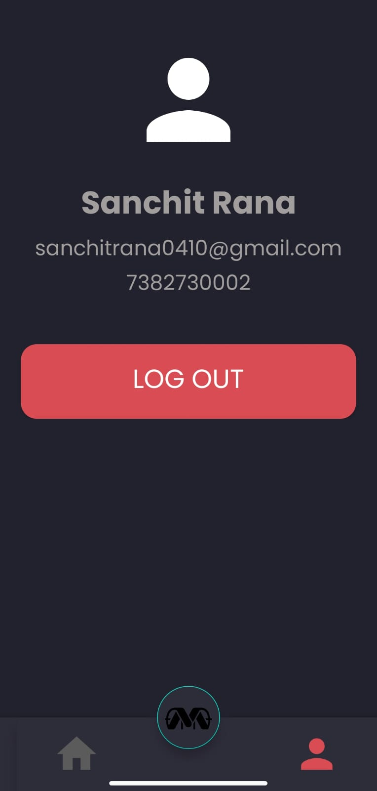

# MovieMatch

**MovieMatch** is an Android application designed to help users connect and discover movies in a social setting. The app allows users to create or join rooms, with the host selecting movie genres and swiping through potential movie options. Guests can view the genres selected by the host. Future updates will introduce more robust features, including swiping and matching functionality for guests.

 

## Key Features

- **User Authentication**: Powered by Firebase, allowing seamless registration and login for users.
- **Room Management**: Hosts can create rooms, and other users can join via an invite or room code.
- **Genre Selection**: Hosts select a movie genre, and guests can see real-time updates on the selected genre.
- **TMDb Integration**: Movies are fetched dynamically from **The Movie Database (TMDb)**, ensuring an updated and relevant list of movies for hosts to swipe through.
- **Real-Time Sync**: All room activities, including genre selection, are synchronized in real time using Firebase.

## Upcoming Features

- **Swiping for Guests**: In the future, guests will also be able to swipe on movies, facilitating a collaborative movie selection process.
- **Matching System**: A swiping system for both hosts and guests to match on their preferred movie choices.
- **Enhanced UI/UX**: Improvements to the interface for a smoother user experience.

## Tech Stack

- **Android Development (Java/Kotlin)**: Core development of the application.
- **Firebase**: Handles user authentication, database storage, and real-time data sync.
- **TMDb API**: Fetches movie details such as genres, titles, and images.
- **Material Design**: Modern and intuitive design principles for a clean user interface.

## How It Works

1. **Authentication**: Users sign up or log in through Firebase Authentication.
2. **Create or Join Rooms**: Hosts can create rooms, while others can join using an invite code.
3. **Select a Genre**: Hosts choose a genre, and guests are notified of the selection in real time.
4. **Movie Swiping (Host Only)**: The host can swipe through movies from the selected genre, powered by the TMDb API.

## Getting Started

To set up the project on your local machine:

1. Clone the repository:
   ```bash
   git clone <https://github.com/DevilSpecial/MovieMatch.git>
   2. Open the project in Android Studio.
3. Configure Firebase by adding your `google-services.json` file.
4. Sign up for a TMDb API key and add it to the project:
   - Go to [TMDb](https://www.themoviedb.org/) and sign up for an API key.
   - Add your TMDb API key in the appropriate section of the code.

## Installation

1. Install Android Studio and clone the repository.
2. Configure Firebase with your project.
3. Run the app on an Android emulator or a physical device.

## Future Enhancements

- **Swiping and Matching for Guests**: Both hosts and guests will be able to swipe on movies, and the app will help them match on a movie selection.
- **Push Notifications**: Notify users when a host selects a new genre or when a movie match is found.
- **Enhanced Search and Filters**: Implement advanced movie search capabilities and filters to improve user choices.

## Screenshots

<!-- Add screenshots here -->
## Screenshots

- **Home Page**:
  

- **Login Screen**:
  

- **Room Creation**:
  

- **Card View**:
  

- **Swiping View**:
  

- **Genre Selection**:
  

  ## Download the App

To download the MovieMatch app, scan the QR code below or click the [Google Drive link](https://drive.google.com/file/d/1Cw5UB-WafMj9w56HH2Yupy4IDfmceCBV/view?usp=drive_link).

- **QR Code**:
  


